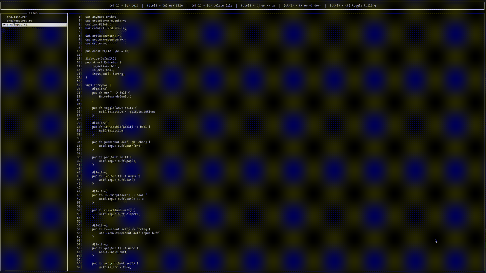

# Refer

<div>
    <div align="center">
        
    </div>
    <div align="center">
        
    </div>
    <br>
    <p>A TUI app to open, read and tail multiple text files at once. Refer also provides convenient key shortcuts to make navigation simple and fast.</p>
</div>



## Installation

Before you start make sure you have rust installed on your system https://www.rust-lang.org/tools/install. Once that is done, then proceed with cloning the repository.

```console
$ git clone --depth=1 git@github.com:Feohr/refer.git
```
Navigate into the `refer` folder and run the release build command.

```console
$ cargo build --release
```

The binary should be present under the target folder `target/release/refer`. Go ahead and save this binary in the system `bin` folder if you wish to.

## Usage

Run directly via the terminal. The binary expects a space separated array of file paths as arguments.

### Key bindings

|       Keys        |                   Action              |
|-------------------|---------------------------------------|
| `ctrl + q`        | quit the app.                         |
| `ctrl + n`        | add a new file.                       |
| `ctrl + d`        | delete a file.                        |
| `(j or ↑)`        | move up the file buffer.              |
| `(k or ↓)`        | move down the file buffer             |
| `ctrl + (j or ↑)` | move to the top of the file buffer.   |
| `ctrl + (k or ↓)` | move to the bottom of the file buffer |
| `ctrl + t`        | toggle tail mode                      |
| `(h or ←)`        | switch to file list                   |
| `(l or →)`        | switch to file buffer                 |
